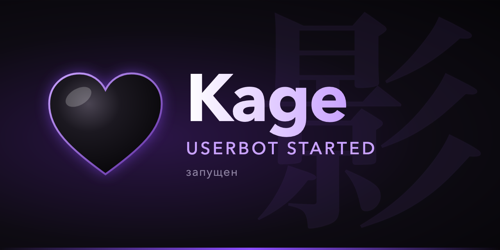
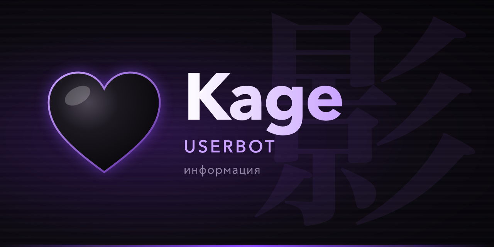
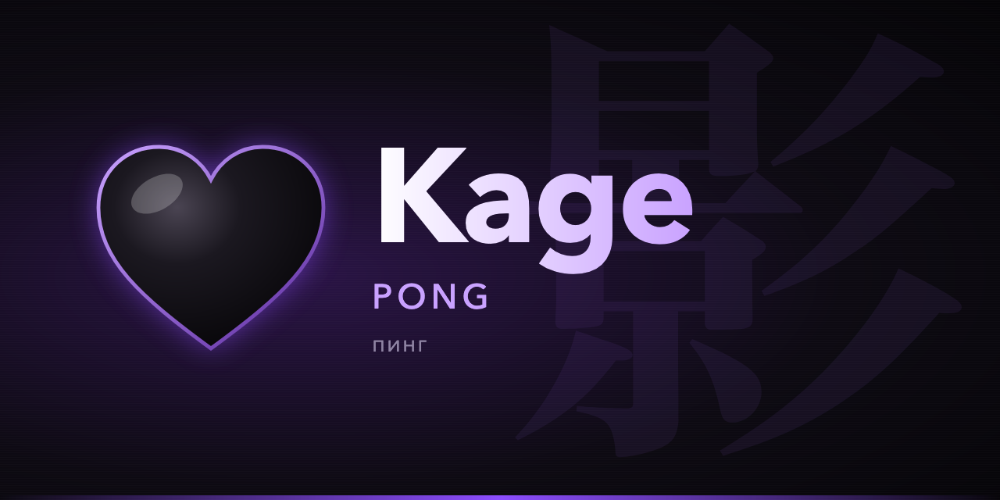
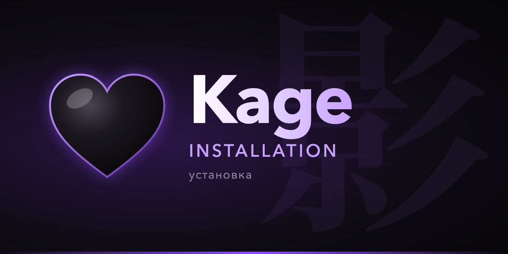

<div align="center">
  
  <h1>🖤 Kage Userbot</h1>
  <p><b>影 — "shadow".</b> Modular Telegram userbot that quietly works on your account</p>

  <p>
    <a href="#">
      
    </a>
    <a href="#">
      
    </a>
    <a href="#">
      
    </a>
    <a href="#">
      
    </a>
    <br>
    <a href="#">
      
    </a>
    <a href="#">
      
    </a>
    <a href="https://github.com/gerdaroot/Kage/pkgs/container/kage">
      
    </a>
    <br>
    <a href="https://github.com/gerdaroot/Kage/blob/master/README.md">
      
    </a>
    <a href="https://github.com/gerdaroot/Kage/blob/master/README_RU.md">
      
    </a>
  </p>

  
</div>

---

## ⚠️ Security Notice

> **Important Security Advisory**
> A module is Python code with full access to your account. Installing modules from untrusted developers
> can get your session stolen, messages sent on your behalf or chats deleted.
>
> **Recommendations:**
> - ✅ Download modules only from repositories and developers you trust, and read the code first
> - ❌ Do NOT install modules if unsure about their safety
> - ⚠️ Be careful with powerful commands (`.terminal`, `.e`, `.ecpp`, etc.)
> - 🔐 Turn on a Telegram cloud password (2FA) and check Settings → Devices now and then

---

## 🚀 Installation

### 🐳 Docker (recommended)

```bash
git clone https://github.com/gerdaroot/Kage && cd Kage
docker compose run --rm kage     # first start: API ID/hash, then log in by QR code or phone
docker compose up -d             # keep it running in the background
```

Or with one command (installs Docker if missing):

```bash
curl -fsSL https://raw.githubusercontent.com/gerdaroot/Kage/master/docker.sh | bash
```

To update, run `docker compose pull && docker compose up -d`. Your session and modules stay in the `kage-data` volume.

> Run only **one** Kage instance per session: finish the first-start container (`Ctrl+C`) before `docker compose up -d`.

### VPS/VDS
> **Note for VPS/VDS users:**
> Add `--root` when running as root (to skip the force_insecure prompt).

<details>
<summary><b>Ubuntu / Debian</b></summary>

```bash
sudo apt update && sudo apt install git python3 python3-venv -y && \
git clone https://github.com/gerdaroot/Kage && \
cd Kage && \
python3 -m venv .venv && \
source .venv/bin/activate && \
pip install -r requirements.txt && \
python3 -m kage
```
</details>

<details>
<summary><b>Fedora</b></summary>

```bash
sudo dnf update -y && sudo dnf install git python3 -y && \
git clone https://github.com/gerdaroot/Kage && \
cd Kage && \
python3 -m venv .venv && \
source .venv/bin/activate && \
python3 -m pip install -r requirements.txt && \
python3 -m kage
```
</details>

<details>
<summary><b>Arch Linux</b></summary>

```bash
sudo pacman -Syu --noconfirm && sudo pacman -S git python --noconfirm --needed && \
git clone https://github.com/gerdaroot/Kage && \
cd Kage && \
python3 -m venv .venv && \
source .venv/bin/activate && \
python3 -m pip install -r requirements.txt && \
python3 -m kage
```
</details>

<details>
<summary><b>macOS</b></summary>

```bash
git clone https://github.com/gerdaroot/Kage && cd Kage && \
python3 -m venv .venv && source .venv/bin/activate && \
pip install -r requirements.txt && python3 -m kage
```
</details>

### Other

<details>
<summary><b>WSL (Windows)</b></summary>

> **⚠️ WARNING: can be unstable!**

1. **Install WSL.** Open PowerShell as administrator and run:
   ```powershell
   wsl --install -d Ubuntu-22.04
   ```
   > *WSL needs Windows 10 build 2004+ or Windows 11 and a PC with virtualization support.
   > For older systems see [this page](https://learn.microsoft.com/windows/wsl/install-manual).*
2. **Restart the PC and open Ubuntu 22.04.**
3. **Run:**
   ```bash
   sudo apt update && sudo apt install git python3 python3-venv -y && \
   git clone https://github.com/gerdaroot/Kage && cd Kage && \
   python3 -m venv .venv && source .venv/bin/activate && \
   pip install -r requirements.txt && python3 -m kage
   ```
</details>

<details>
<summary><b>Phone (UserLAnd)</b></summary>

1. Install <a href="https://play.google.com/store/apps/details?id=tech.ula">UserLAnd</a>.
2. Open it and choose **Ubuntu → Minimal → Terminal**.
3. Wait for the distribution to install. Now's a good time to make some tea.
4. In the terminal, run:
   ```bash
   sudo apt update && sudo apt upgrade -y && sudo apt install python3 git python3-pip python3-venv -y && \
   git clone https://github.com/gerdaroot/Kage && cd Kage && \
   python3 -m venv .venv && source .venv/bin/activate && \
   pip install -r requirements.txt && python3 -m kage
   ```
5. Follow the prompts to enter your API credentials and log in.

> **Voila! Kage is running on your phone.**
</details>

> **🔗 Where to get API_ID and API_HASH?** [my.telegram.org](https://my.telegram.org/apps) → API development tools

---

## 🖤 What makes Kage different

| Feature | Description |
|---------|-------------|
| 🖤 **Own look** | Kage wordmark, animated black-heart premium emoji, terminal banner, banners and avatars shipped in the repo |
| 🕶 **Honest client identity** | Introduces itself to Telegram as `Kage Userbot` with your real OS, the same on every restart. No random devices, no posing as official apps |
| 🔒 **No upstream remote control** | Updates and announcements come only from this repository. No forced join to third-party chats, no hardcoded foreign chat IDs |
| 🐳 **Sane Docker** | Code ships in the image, your session and data live in a volume. Runs as a non-root user. Prebuilt `ghcr.io/gerdaroot/kage` for amd64 and arm64 |
| 🧹 **Cleaner presets** | Doxxing and spam modules are removed from the default module presets |
| 🛟 **Sturdier first start** | A missing avatar no longer crashes startup; a deleted log channel is recreated |

## ✨ Inherited from Hikka & Heroku

| Feature | Description |
|---------|-------------|
| 🔄 **Module compatibility** | Works with Hikka, Heroku, FTG and GeekTG modules. `hikka`/`heroku`/`telethon`/`hikkatl` imports are redirected automatically |
| 🆕 **Latest Telegram layer** | Forums and the newest Telegram features |
| 🔒 **Security rules** | Owners, security groups, targeted per-user/per-chat rules, API flood protection |
| ▶️ **Inline elements** | Forms, galleries and lists through your own inline bot |
| 💾 **Backups** | Automatic database and module backups into your log channel |
| 🌍 **Languages** | English, Русский, Українська, Deutsch, 日本語 and more |

<details>
  <summary><b>🖼 Screens</b></summary>
  
  
  
  
</details>

---

## 🧩 Modules

```
.help               list of modules
.help <module>      module commands
.dlm <link>         load a module from a link
.lm                 load a module from a replied .py file
.ulm <name>         unload a module
```

Heroku's developer documentation applies to Kage modules as-is: [dev.heroku-ub.xyz](https://dev.heroku-ub.xyz/)

---

## 📋 Requirements

- **Python 3.10+** (Docker image uses 3.13)
- **API credentials** from [Telegram Apps](https://my.telegram.org/apps)

---

## 💬 Support

[](https://github.com/gerdaroot/Kage/issues)

---

## ⚠️ Usage Disclaimer

> This project is provided as-is. The developer takes **NO responsibility** for:
> - Account bans or restrictions
> - Message deletions by Telegram
> - Security issues from scam modules
> - Session leaks from malicious modules
>
> **Security recommendations:**
> - Enable `.api_fw_protection`
> - Avoid installing many modules at once
> - Review [Telegram's Terms](https://core.telegram.org/api/terms)

---

## 🙏 Acknowledgements

- [**Hikari**](https://github.com/hikariatama) for Hikka (project foundation)
- [**Codrago**](https://github.com/coddrago) for Heroku (the fork Kage is based on)
- [**Lonami**](https://github.com/LonamiWebs) for Telethon (Heroku-TL backbone)

Licensed under [GNU AGPLv3](LICENSE). If you let others use your modified version, you must publish its source.
